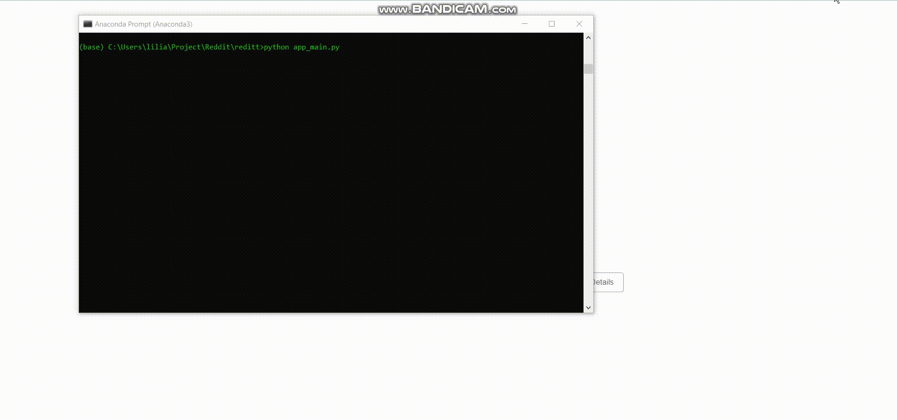

# Reddit Post Classification
Reddit classification is a program that scrapes subreddits, trains, evaluates and predicts with  four different  nlp  pretrained models from Tensorflow hub and finally serves the most convenient model in a basic flask app.

## Installation.
First of all unzip the "reddit_class" folder in the same path or/and environment install the requiriment.txt. 
Use the package manager [pip](https://pip.pypa.io/en/stable/) this file

```bash
pip install -r /path/requirements.txt
```

## Reddit Scraping.

To implement a  Reddit crawler or scraper use the [Reddit API](https://www.reddit.com/wiki/api). The authorization keys are in the folder "crawler" -> constants.py please replace them with your personal reddit [OAuth2](https://github.com/reddit-archive/reddit/wiki/OAuth2). In the similar way replace the Reddit username and password in Password.txt.
 
The ten subreddits types for the classification are in the same crawler folder in subreddit.txt if you want to change them.

Active this crawler running.

```bash
cd crawler
python crawler_Reddit.py
```
The results will be in "data" folder at reddit_data.csv.

## Multiclass Text Classification Models.

I evaluated four different **NLP** Tensor_Hub models preserving the Transfer Learning criteria due to the small amount of train data.

Please Run this program using **GPU** and enough RAM memory

1. [BERT](https://tfhub.dev/tensorflow/bert_en_uncased_L-12_H-768_A-12/4) 
2. [Universal Sentence Encoder](https://tfhub.dev/google/universal-sentence-encoder/1)
3. [NNLM dim128](https://tfhub.dev/google/nnlm-en-dim128/2)
4. [NNLM dim 50](https://tfhub.dev/google/nnlm-en-dim50/1)

### Train and tuning
We will use tensorflow hub APIs training the data obtained in the  previous step at the reddit_data.csv

To train and tune BERT the model was trainable 109.489.931 parameters please check "model_template.py" file to understand the structure of all our models.
```bash
cd..
cd models
python BERT_train_tune.py
```
**Results**: "BERT_model.h5", "accuracy_BERT_Models_tuned.png", "loss_BERT_Models_tuned.png" in the same models folder.

The original result are in "plots and model_trained" sub-folders.

Universal Sentence Encoder, NNLM dim128, NNLM dim50 are trained and tuning  in the same file due to similarity in the model structures.
```bash
cd models
python tuning_comtext_model.py
```
**Results**:"nnlm-en-dim50_model.h5", "nnlm-en-dim128_model.h5", "universal-sentece-encoder_model.h5" and accuracy and loss plot of every model.

### Evaluate and predict.

The evaluation and predictions of the all models, using the reddit_data_test.csv dataset is obtained by crawling ten news posts of every class. the results are generated running "evaluate_model.py".

```bash
cd models
python evaluate_model.py
```
**Results**: generate model.json files, detection.csv files, confusion matrix plots and the comparison table evaluating all models.

## Flask App - Model serving
I deployed a model serving in my local machine using Flask basic app.
to run this application.

```bash
cd..
python app_main.py
```
Changing model.json and model.h5 inside the object RedditClassificationModel allow us change the trained model  in the flask app in app_main.py.

```python
from flask import Flask, render_template, url_for, request, jsonify
from flask_restful import API, Resource
from model_incident import RedditClassificationModel

model = RedditClassificationModel('models/models_trained/nnlm-en-dim128.json', 'models/models_trained/nnlm-en-dim128_model.h5')
```

**Please insert the post text inside the container without quotation**.




